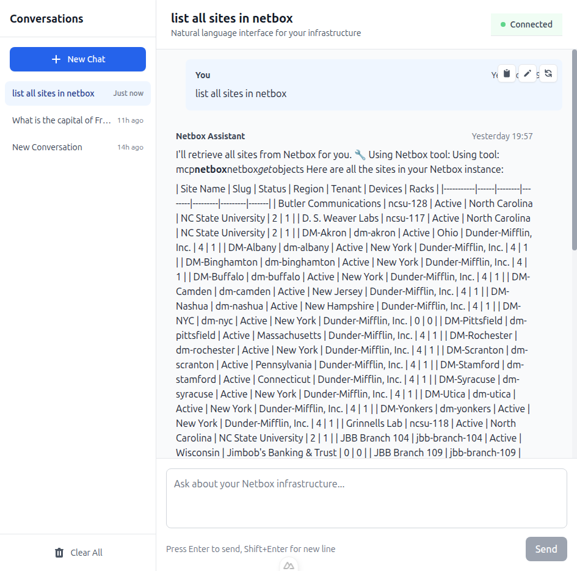
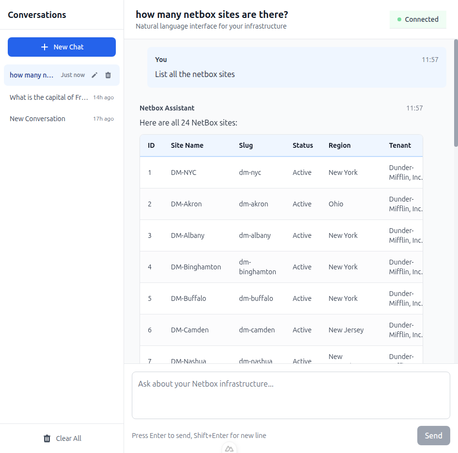
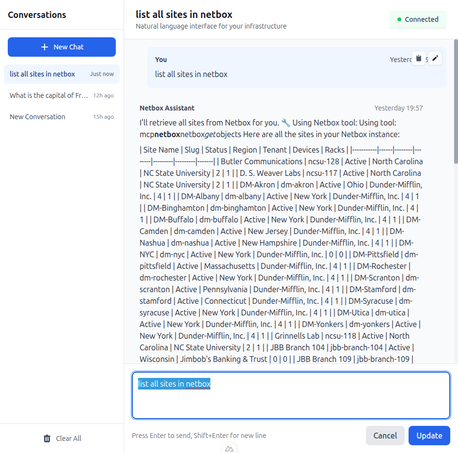

# Netbox Chatbox - AI-Powered Netbox Query Interface

A full-stack natural language interface for querying Netbox infrastructure data using Claude AI and the Claude Agent SDK.



## Features

### Core Capabilities
- **Natural Language Queries**: Ask questions about your Netbox data in plain English
- **Real-time Streaming**: WebSocket-based streaming responses for instant feedback
- **MCP Integration**: Uses Netbox MCP server for secure, structured API access
- **Continuous Conversations**: Maintains context across multiple queries

### Web Interface (New!)
- **Modern Chat UI**: Full-featured web interface built with Nuxt 3
- **Conversation Management**: Multiple conversations with sidebar navigation
- **Message Editing**: Edit and re-send previous messages
- **Professional Tables**: Syntax-highlighted table rendering for structured data
- **Session Reset**: Clear conversation context without losing history
- **Auto-reconnect**: Automatic WebSocket reconnection with exponential backoff

### Developer Experience
- **CLI Tool**: Interactive command-line interface with REPL mode
- **Type-Safe**: Built with Pydantic models and TypeScript
- **Well-Tested**: 83+ unit tests covering all functionality
- **MCP v1.1 Compatible**: Enhanced field filtering and API patterns

## Prerequisites

- Python 3.13+
- Node.js 18+ (for web interface)
- uv (Python package manager)
- Running Netbox instance with API access
- Anthropic API key

## Quick Start

### 1. Clone and Setup

```bash
git clone https://github.com/YOUR_USERNAME/netbox-chatbox.git
cd netbox-chatbox

# Install backend dependencies
uv sync

# Install frontend dependencies
cd frontend
npm install
cp .env.example .env  # Frontend WebSocket configuration
cd ..
```

### 2. Configure Environment

```bash
# Copy environment template
cp .env.example .env

# Edit .env with your values:
# - ANTHROPIC_API_KEY: Your Claude API key
# - NETBOX_URL: Your Netbox instance URL
# - NETBOX_TOKEN: Your Netbox API token
```

### 3. Start the Application

**Terminal 1 - Backend:**
```bash
./start_server.sh
# Server starts on http://localhost:8001
```

**Terminal 2 - Frontend:**
```bash
cd frontend
npm run dev
# UI available at http://localhost:3000
```

### 4. Open the Web Interface

Navigate to `http://localhost:3000` and start chatting with your Netbox data!



## Usage

### Web Interface (Recommended)

The easiest way to interact with Netbox is through the web interface at `http://localhost:3000`. Features include:

- **Chat Interface**: Natural language queries with real-time responses
- **Conversation Management**: Create, switch between, and manage multiple conversations
- **Message Editing**: Edit and re-send previous messages
- **Session Reset**: Clear Claude's context while preserving chat history
- **Professional Tables**: Beautifully formatted data tables with syntax highlighting



### CLI Tool

For command-line usage, the CLI provides both interactive and one-shot modes:

#### Single Query Mode

Execute a query and exit:

```bash
# Simple query
uv run python netbox_cli.py "List all sites"

# With verbose output (shows tool usage)
uv run python netbox_cli.py --verbose "Show devices in DC1"

# JSON output (for piping)
uv run python netbox_cli.py --json "List VLANs" | jq .

# Without colors (for piping/logging)
uv run python netbox_cli.py --no-color "Find active devices" | tee query.log
```

#### Interactive Mode

REPL-style interface with command history:

```bash
# Start interactive mode
uv run python netbox_cli.py --interactive

# Or use shorthand
uv run python netbox_cli.py -i
```

Example session:
```
$ uv run python netbox_cli.py -i
🔌 Connecting to Netbox Chatbox...
✅ Connected! Type your query or 'exit' to quit.

netbox> List all sites
🔧 [Using tool: netbox_get_objects]
Here are the 24 sites in your Netbox instance:
[Table with site details...]

netbox> Show devices in DC1
🔧 [Using tool: netbox_get_objects]
Here are the devices in DC1:
[Device details...]

netbox> exit
👋 Goodbye!
```

**Features:**
- ✅ Real-time streaming responses
- ✅ Command history (use up/down arrows)
- ✅ Conversation context maintained within session
- ✅ Colored output with visual indicators
- ✅ Tool usage visibility (with `--verbose`)

#### CLI Options

```
usage: netbox_cli.py [-h] [-i] [-v] [--json] [--no-color]
                      [--url URL] [--timeout TIMEOUT] [query]

Options:
  query                 Query to execute (omit for interactive mode)
  -i, --interactive     Run in interactive mode (REPL)
  -v, --verbose         Show verbose output (tool usage, thinking, etc.)
  --json                Output raw JSON chunks (for piping/processing)
  --no-color            Disable colored output
  --url URL             WebSocket URL (default: ws://localhost:8001/ws/chat)
  --timeout TIMEOUT     Query timeout in seconds (default: 60)
```

### Example Queries

Try these queries with the CLI:

- "List all sites"
- "Show me devices in the datacenter"
- "What VLANs are configured?"
- "Find all devices with status active"
- "Show IP addresses in the 10.0.0.0/8 range"
- "List all racks in site MDF"
- "Show me device details for core-router-1"
- "What IP prefixes exist?"

### WebSocket API (Advanced)

For programmatic access, connect directly to the WebSocket API at `ws://localhost:8001/ws/chat`:

**Client → Server:**
```json
{
  "message": "List all sites in Netbox"
}
```

**Server → Client:**
```json
{
  "type": "text",
  "content": "Here are your Netbox sites...",
  "completed": false
}
```

Final message has `completed: true`.

## Architecture

```
backend/
├── api.py          # FastAPI WebSocket server
├── agent.py        # Claude Agent SDK integration
├── config.py       # Environment configuration
├── mcp_config.py   # MCP server configuration
├── models.py       # Pydantic data models
└── utils.py        # Helper functions

frontend/
├── components/     # Vue components (chat UI)
├── composables/    # WebSocket connection logic
├── pages/          # Main chat interface
├── types/          # TypeScript definitions
└── utils/          # Formatting utilities

tests/              # Pytest unit tests (83 tests)
netbox_cli.py       # Interactive CLI tool
docs/               # Documentation and screenshots
```

### Key Design Patterns

1. **ClaudeSDKClient as Context Manager**: Long-lived sessions for continuous conversations
2. **WebSocket Streaming**: Real-time response delivery
3. **MCP Server Integration**: Secure, structured Netbox API access via stdio subprocess
4. **Type Safety**: Pydantic models throughout
5. **Async/Await**: Full async support for performance

## Testing

Run all unit tests:
```bash
uv run pytest
```

Run with coverage:
```bash
uv run pytest --cov=backend --cov-report=term-missing
```

Current coverage: 83 tests (59 backend + 24 CLI), all passing ✅

## Troubleshooting

See [TROUBLESHOOTING.md](TROUBLESHOOTING.md) for common issues and solutions.

Most common issue: **MCP 403 Forbidden Error**
- **Cause**: Wrong NETBOX_TOKEN in shell environment
- **Fix**: Use `./start_server.sh` to ensure correct environment
- **Details**: See [MCP_403_FIX.md](docs/troubleshooting/MCP_403_FIX.md)

## API Endpoints

### WebSocket `/ws/chat`

Bidirectional streaming chat interface.

**Client → Server:**
```json
{
  "message": "your query here"
}
```

**Server → Client:**
```json
{
  "type": "text|tool_use|error",
  "content": "response content",
  "completed": false|true
}
```

### GET `/health`

Health check endpoint.

**Response:**
```json
{
  "status": "healthy",
  "service": "netbox-chatbox-api",
  "version": "0.1.0"
}
```

## Development

### Project Structure

- `backend/` - Core application code
- `tests/` - Pytest unit tests
- `.env` - Environment configuration (not committed)
- `docs/development/PLANNING.md` - Architecture and design decisions
- `docs/development/TASK.md` - Task tracking

### Adding New Features

1. Check `docs/development/TASK.md` for existing tasks
2. Add new task with description and date
3. Implement with unit tests
4. Mark task as completed in `docs/development/TASK.md`

### Code Style

- Follow PEP8
- Use type hints everywhere
- Document functions with Google-style docstrings
- Format with `black`
- Files must be < 500 lines (split if larger)

## MCP Server Configuration

The Netbox MCP server is configured in [backend/mcp_config.py](backend/mcp_config.py:1-50).

**Location:** `/home/ola/dev/rnd/mcp/testmcp/netbox-mcp-server/server.py`

**Environment Variables Passed:**
- `NETBOX_URL`: Netbox instance URL
- `NETBOX_TOKEN`: API authentication token
- `LOG_LEVEL`: Logging verbosity

**Available Tools:**
- `netbox_get_objects`: Query Netbox objects with filters
- `netbox_get_object_by_id`: Get specific object details
- `netbox_create_object`: Create new Netbox objects
- `netbox_update_object`: Update existing objects
- `netbox_delete_object`: Delete objects

## Security

- API tokens stored in `.env` (not committed)
- MCP server runs as subprocess with explicit env vars
- CORS configured for specified origins only
- Read-only token recommended for MCP server

## Performance

- WebSocket for low-latency streaming
- Async/await throughout for concurrency
- Claude Agent SDK handles rate limiting
- MCP server connection pooling

## Future Enhancements

See `docs/development/TASK.md` for potential improvements:
- User authentication (OAuth, JWT)
- Query history export/import
- Multi-user support with separate sessions
- Advanced filtering and search operators
- Docker containerization
- Kubernetes deployment manifests
- Real-time collaboration features

## License

MIT License - see [LICENSE](LICENSE) file for details

## Contributing

1. Check `CLAUDE.md` for coding guidelines
2. Follow the patterns in `PLANNING.md`
3. Add unit tests for all new code
4. Update `TASK.md` with your work

## Support

For issues, see [TROUBLESHOOTING.md](TROUBLESHOOTING.md) or create an issue in the repository.
