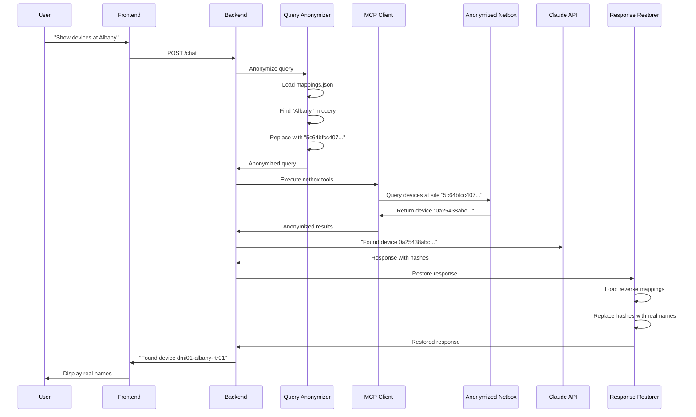

# Mapping Implementation Plan: Complete Strategy for Query/Response Translation

**Project**: Netbox Data Anonymization with Translation Layer
**Document Version**: 1.0
**Date**: 2026-03-30
**Author**: Claude Code (Sonnet 4.5)
**Implementation Agent**: Claude Opus (recommended)
**Estimated Effort**: 8-12 hours

---

## Executive Summary

### Objective
Implement a complete mapping-based translation system that allows users to query Netbox using real entity names while Claude API receives only anonymized data, with responses automatically translated back to real names.

### Current State
- ✅ Production Netbox running (localhost:8000) with real data
- ✅ Anonymized Netbox running (localhost:8001) with SHA256/MD5 hashed names
- ✅ Both instances have identical IDs and relationships (100% data integrity)
- ✅ Backend architecture exists for translation (`query_anonymizer.py`, `response_restorer.py`)
- ❌ No mapping files exist
- ❌ Anonymization disabled (`ANONYMIZATION_ENABLED=false`)
- ❌ Cannot query by real names in anonymized instance

### Target State
- ✅ Mapping files generated and validated
- ✅ Backend queries anonymized Netbox with translations
- ✅ Users query with real names ("DM-Albany")
- ✅ Claude receives anonymized data ("5c64bfcc407eab...")
- ✅ Users receive responses with real names

### Success Metrics
1. User query "Show devices at Albany" successfully finds devices
2. Claude API receives only hashed values (verified in logs)
3. User sees real device names in response
4. 100% mapping coverage for all anonymized fields
5. Query/response translation latency < 50ms

---

## Problem Statement

### Current User Experience

**With Production Netbox (localhost:8000)**:
```
User: "Show devices at Albany"
Claude sees: "DM-Albany", "dmi01-albany-rtr01"
Response: "Found device dmi01-albany-rtr01 at DM-Albany"
Issue: ❌ PII sent to Anthropic API
```

**With Anonymized Netbox (localhost:8001)**:
```
User: "Show devices at Albany"
Claude sees: No results (can't find "Albany")
Response: "No sites matching 'Albany' found"
Issue: ❌ User cannot query by real names
```

### Required Solution

**With Translation Layer**:
```
User: "Show devices at Albany"
       ↓ [Query Anonymization]
Backend translates: "Albany" → "5c64bfcc407eab..."
       ↓ [Query Anonymized DB]
Netbox returns: Device "0a25438abc45eb..."
       ↓ [Send to Claude]
Claude sees: Hashed values only ✅
       ↓ [Response Restoration]
Backend translates: "0a25438abc45eb..." → "dmi01-albany-rtr01"
       ↓ [Return to User]
Response: "Found device dmi01-albany-rtr01 at DM-Albany" ✅
```

---

## Architecture Overview

### Component Diagram

```
┌─────────────────────────────────────────────────────────┐
│                     USER INTERFACE                       │
│              (http://localhost:3002)                    │
└────────────────────┬────────────────────────────────────┘
                     │ Query: "Show devices at Albany"
                     ↓
┌─────────────────────────────────────────────────────────┐
│                  BACKEND (PORT 8003)                    │
├─────────────────────────────────────────────────────────┤
│  1. Query Anonymizer                                    │
│     - Load mappings from JSON                           │
│     - Regex pattern matching                            │
│     - Replace: "Albany" → "5c64bfcc407eab..."          │
│                                                         │
│  2. MCP Client                                          │
│     - Query anonymized Netbox (localhost:8001)         │
│     - Receive hashed results                           │
│                                                         │
│  3. Claude Agent                                        │
│     - Send anonymized data to Claude API               │
│     - Receive response with hashes                     │
│                                                         │
│  4. Response Restorer                                   │
│     - Load reverse mappings from JSON                   │
│     - Replace: "5c64bfcc407eab..." → "Albany"          │
│     - Replace: "0a25438abc45eb..." → "dmi01-albany-rtr01" │
└────────────────────┬────────────────────────────────────┘
                     │ Response: "Found device dmi01-albany-rtr01"
                     ↓
┌─────────────────────────────────────────────────────────┐
│                     USER INTERFACE                       │
│                  (sees real names)                      │
└─────────────────────────────────────────────────────────┘

External Data Flow:
┌──────────────────┐           ┌──────────────────┐
│  Production DB   │           │  Anonymized DB   │
│  localhost:8000  │           │  localhost:8001  │
│                  │           │                  │
│ Site: DM-Albany  │  ═══════  │ Site: 5c64bfcc.. │
│ Dev: dmi01-...   │  Mapping  │ Dev: 0a25438..   │
└──────────────────┘           └──────────────────┘
         ↓                              ↓
    [Query both]                  [Query both]
         ↓                              ↓
┌─────────────────────────────────────────────────────────┐
│            MAPPING GENERATION SCRIPT                    │
│          (scripts/generate_mappings.py)                 │
│                                                         │
│  Output: backend/anonymization/mappings/                │
│          - mappings_latest.json                         │
│          - mappings_YYYYMMDD_HHMMSS.json               │
└─────────────────────────────────────────────────────────┘
```

### Data Flow Sequence



---

## Detailed Implementation Plan

### Phase 1: Mapping Generation Script (3-4 hours)

#### 1.1 Create Script Structure

**File**: `scripts/generate_mappings.py`

**Purpose**: Query both production and anonymized databases, match by ID, export bidirectional mappings.

**Requirements**:
- Read database credentials from `.env.anonymization`
- Connect to both PostgreSQL instances
- Query all anonymized tables
- Generate forward mappings (real → anonymized)
- Generate reverse mappings (anonymized → real)
- Export to timestamped JSON file
- Create symlink to `mappings_latest.json`

**Database Connection Details**:
```python
# Production Database
HOST: netbox-docker-postgres-1 (or localhost:5432 via Docker)
PORT: 5432
DATABASE: netbox
USER: netbox
PASSWORD: J5brHrAXFLQSif0K

# Anonymized Database
HOST: netbox-anon-db (or localhost:5433 via Docker)
PORT: 5432
DATABASE: netbox_anonymized
USER: netbox
PASSWORD: netbox
```

#### 1.2 Tables and Columns to Map

From `greenmask-config-v2.yml`, these fields are anonymized:

| Table | Columns | Hash Type | Notes |
|-------|---------|-----------|-------|
| `dcim_site` | `name`, `slug` | SHA256 | Physical/shipping addresses also masked |
| `dcim_device` | `name`, `serial`, `asset_tag` | SHA256 (name), MD5 (serial/asset) | Comments masked |
| `dcim_interface` | `name` | SHA256 | Description masked |
| `ipam_ipaddress` | `dns_name` | SHA256 | Address (inet) NOT anonymized |
| `ipam_prefix` | - | - | Prefix (cidr) NOT anonymized, description masked |
| `ipam_vlan` | `name` | SHA256 | Description masked |
| `tenancy_tenant` | `name`, `slug` | SHA256 | Description masked |
| `tenancy_contact` | `name`, `email`, `phone`, `address` | SHA256/Random | Email/phone randomized |
| `circuits_provider` | `name`, `slug` | SHA256 | - |
| `circuits_circuit` | `cid` | SHA256 | Description/comments masked |

**Priority for Phase 1** (implement these first):
1. ✅ `dcim_site.name` (critical for site queries)
2. ✅ `dcim_site.slug` (used in URLs)
3. ✅ `dcim_device.name` (critical for device queries)
4. ✅ `dcim_device.serial` (useful for hardware queries)
5. ✅ `ipam_ipaddress.dns_name` (useful for DNS queries)
6. ✅ `tenancy_tenant.name` (useful for tenant queries)

**Lower priority** (implement if time allows):
- `dcim_interface.name` (less often queried by name)
- `ipam_vlan.name` (less critical)
- `circuits_circuit.cid` (less common queries)

#### 1.3 Mapping Generation Algorithm

```python
def generate_mappings():
    """
    Generate bidirectional mappings between production and anonymized DBs.

    Returns:
        dict: {
            "forward": {
                "dcim_site.name": {"DM-Albany": "5c64bfcc407eab..."},
                "dcim_device.name": {"dmi01-albany-rtr01": "0a25438abc45eb..."}
            },
            "reverse": {
                "dcim_site.name": {"5c64bfcc407eab...": "DM-Albany"},
                "dcim_device.name": {"0a25438abc45eb...": "dmi01-albany-rtr01"}
            },
            "metadata": {
                "generated_at": "2026-03-30T16:30:00Z",
                "production_db": "netbox@localhost:8000",
                "anonymized_db": "netbox_anonymized@localhost:8001",
                "tables_processed": 10,
                "total_mappings": 245
            }
        }
    """

    mappings = {"forward": {}, "reverse": {}, "metadata": {}}

    # Tables to process (priority order)
    tables_to_map = [
        ("dcim_site", ["name", "slug"]),
        ("dcim_device", ["name", "serial", "asset_tag"]),
        ("ipam_ipaddress", ["dns_name"]),
        ("tenancy_tenant", ["name", "slug"]),
        ("dcim_interface", ["name"]),
        ("ipam_vlan", ["name"]),
        ("circuits_provider", ["name", "slug"]),
        ("circuits_circuit", ["cid"]),
    ]

    total_mappings = 0

    for table, columns in tables_to_map:
        for column in columns:
            key = f"{table}.{column}"
            mappings["forward"][key] = {}
            mappings["reverse"][key] = {}

            # Query both databases
            query = f"SELECT id, {column} FROM {table} WHERE {column} IS NOT NULL ORDER BY id"

            prod_rows = query_production(query)
            anon_rows = query_anonymized(query)

            # Match by ID and create mappings
            for row_id in prod_rows:
                original = prod_rows[row_id]
                anonymized = anon_rows[row_id]

                # Skip if values are identical (shouldn't happen but defensive)
                if original == anonymized:
                    continue

                # Forward mapping: real → anonymized
                mappings["forward"][key][original] = anonymized

                # Reverse mapping: anonymized → real
                mappings["reverse"][key][anonymized] = original

                total_mappings += 1

    # Add metadata
    mappings["metadata"] = {
        "generated_at": datetime.utcnow().isoformat(),
        "production_db": "netbox@localhost:8000",
        "anonymized_db": "netbox_anonymized@localhost:8001",
        "tables_processed": len(tables_to_map),
        "total_mappings": total_mappings,
        "schema_version": "1.0"
    }

    return mappings
```

#### 1.4 Edge Cases to Handle

1. **NULL values**: Skip rows where column is NULL (no mapping needed)
2. **Empty strings**: Skip empty strings (no mapping needed)
3. **Duplicate values**: Should not exist (IDs are unique), but log warning if found
4. **Mismatched IDs**: If ID exists in prod but not anon, log error (data integrity issue)
5. **Identical values**: If prod and anon values are same, skip (not anonymized)

#### 1.5 Output Format

**File**: `backend/anonymization/mappings/mappings_YYYYMMDD_HHMMSS.json`

```json
{
  "forward": {
    "dcim_site.name": {
      "DM-Albany": "5c64bfcc407eab7e470ed8d4319b7f301aae1195d487c0f4fb28b520fea24434",
      "DM-Akron": "198b688f32c05ae24763626258b831fc79df73db963cfbdea8ab8cdc72405788"
    },
    "dcim_site.slug": {
      "dm-albany": "84d092f288da8ce5613933316bff7f696513b8b00cad47dd5a64fa9e9c13a55e",
      "dm-akron": "8ba570e8b07313c4e5f13a98c4d00c50e4f52c24fe6f99ad14dde03a02ffc228"
    },
    "dcim_device.name": {
      "dmi01-albany-rtr01": "0a25438abc45eb6e97c5d973491fc23446af57cac7524097a702c50818009a94",
      "dmi01-albany-sw01": "0906c405235b3f341c736549153407bbd7e8f37a87fe959bd8c70f08682c145d"
    },
    "dcim_device.serial": {
      "SN12345": "d41d8cd98f00b204e9800998ecf8427e"
    }
  },
  "reverse": {
    "dcim_site.name": {
      "5c64bfcc407eab7e470ed8d4319b7f301aae1195d487c0f4fb28b520fea24434": "DM-Albany",
      "198b688f32c05ae24763626258b831fc79df73db963cfbdea8ab8cdc72405788": "DM-Akron"
    },
    "dcim_site.slug": {
      "84d092f288da8ce5613933316bff7f696513b8b00cad47dd5a64fa9e9c13a55e": "dm-albany",
      "8ba570e8b07313c4e5f13a98c4d00c50e4f52c24fe6f99ad14dde03a02ffc228": "dm-akron"
    },
    "dcim_device.name": {
      "0a25438abc45eb6e97c5d973491fc23446af57cac7524097a702c50818009a94": "dmi01-albany-rtr01",
      "0906c405235b3f341c736549153407bbd7e8f37a87fe959bd8c70f08682c145d": "dmi01-albany-sw01"
    },
    "dcim_device.serial": {
      "d41d8cd98f00b204e9800998ecf8427e": "SN12345"
    }
  },
  "metadata": {
    "generated_at": "2026-03-30T16:30:00Z",
    "production_db": "netbox@localhost:8000",
    "anonymized_db": "netbox_anonymized@localhost:8001",
    "tables_processed": 8,
    "total_mappings": 245,
    "schema_version": "1.0"
  }
}
```

#### 1.6 Script Execution

```bash
# Run mapping generation
python scripts/generate_mappings.py

# Expected output:
# 🔍 Connecting to production database...
# ✅ Connected to netbox@localhost:8000
# 🔍 Connecting to anonymized database...
# ✅ Connected to netbox_anonymized@localhost:8001
#
# 📊 Processing dcim_site.name... (24 mappings)
# 📊 Processing dcim_site.slug... (24 mappings)
# 📊 Processing dcim_device.name... (72 mappings)
# 📊 Processing dcim_device.serial... (45 mappings)
# 📊 Processing ipam_ipaddress.dns_name... (80 mappings)
#
# ✅ Generated 245 total mappings
# 💾 Saved to: backend/anonymization/mappings/mappings_20260330_163000.json
# 🔗 Created symlink: backend/anonymization/mappings/mappings_latest.json
```

#### 1.7 Validation Steps

After generation, script should validate:

1. **Bidirectionality**: Every forward mapping has a reverse mapping
2. **Uniqueness**: No duplicate keys in forward or reverse maps
3. **Non-empty**: All mapped values are non-null and non-empty
4. **Hash format**: SHA256 values are 64 chars hex, MD5 values are 32 chars hex
5. **Coverage**: Count of mappings matches count of anonymized rows

```python
def validate_mappings(mappings):
    """Validate generated mappings for correctness."""
    errors = []

    # Check bidirectionality
    for key in mappings["forward"]:
        if key not in mappings["reverse"]:
            errors.append(f"Missing reverse mapping for {key}")
        else:
            # Check every forward mapping has reverse
            for original, anonymized in mappings["forward"][key].items():
                if anonymized not in mappings["reverse"][key]:
                    errors.append(f"Forward mapping {original}→{anonymized} missing reverse")
                elif mappings["reverse"][key][anonymized] != original:
                    errors.append(f"Reverse mapping mismatch for {anonymized}")

    # Check hash formats
    for key in mappings["forward"]:
        for original, anonymized in mappings["forward"][key].items():
            if len(anonymized) == 64:
                # Should be SHA256 (hex)
                if not re.match(r'^[a-f0-9]{64}$', anonymized):
                    errors.append(f"Invalid SHA256 hash: {anonymized}")
            elif len(anonymized) == 32:
                # Should be MD5 (hex)
                if not re.match(r'^[a-f0-9]{32}$', anonymized):
                    errors.append(f"Invalid MD5 hash: {anonymized}")

    if errors:
        raise ValueError(f"Mapping validation failed:\n" + "\n".join(errors))

    print("✅ Mapping validation passed")
```

---

### Phase 2: Backend Integration (2-3 hours)

#### 2.1 Update Mapping Service

**File**: `backend/anonymization/mapping_service.py`

**Current State**: Exists but likely incomplete or uses different format

**Required Changes**:

```python
class MappingService:
    """
    Service for loading and querying anonymization mappings.
    """

    def __init__(self, mappings_file: str):
        """
        Initialize with path to mappings JSON file.

        Args:
            mappings_file: Path to mappings_latest.json
        """
        self.mappings_file = mappings_file
        self.forward_mappings = {}
        self.reverse_mappings = {}
        self.metadata = {}
        self._load_mappings()

    def _load_mappings(self):
        """Load mappings from JSON file."""
        if not os.path.exists(self.mappings_file):
            raise FileNotFoundError(
                f"Mappings file not found: {self.mappings_file}\n"
                f"Run: python scripts/generate_mappings.py"
            )

        with open(self.mappings_file, 'r') as f:
            data = json.load(f)

        self.forward_mappings = data["forward"]
        self.reverse_mappings = data["reverse"]
        self.metadata = data["metadata"]

        logger.info(f"✅ Loaded {self.metadata['total_mappings']} mappings")

    def get_anonymized(self, original: str, entity_type: str = None) -> Optional[str]:
        """
        Get anonymized value for original value.

        Args:
            original: Original (real) value from user query
            entity_type: Optional hint like "dcim_device.name"

        Returns:
            Anonymized hash, or None if not found
        """
        # If entity_type provided, search only that mapping
        if entity_type and entity_type in self.forward_mappings:
            return self.forward_mappings[entity_type].get(original)

        # Otherwise search all mappings (slower)
        for key in self.forward_mappings:
            if original in self.forward_mappings[key]:
                return self.forward_mappings[key][original]

        return None

    def get_original(self, anonymized: str, entity_type: str = None) -> Optional[str]:
        """
        Get original value for anonymized value.

        Args:
            anonymized: Anonymized hash from Claude response
            entity_type: Optional hint like "dcim_device.name"

        Returns:
            Original (real) value, or None if not found
        """
        # If entity_type provided, search only that mapping
        if entity_type and entity_type in self.reverse_mappings:
            return self.reverse_mappings[entity_type].get(anonymized)

        # Otherwise search all mappings (slower)
        for key in self.reverse_mappings:
            if anonymized in self.reverse_mappings[key]:
                return self.reverse_mappings[key][anonymized]

        return None

    def get_all_anonymized_values(self, entity_type: str) -> List[str]:
        """Get all anonymized values for entity type."""
        if entity_type in self.forward_mappings:
            return list(self.forward_mappings[entity_type].values())
        return []

    def get_all_original_values(self, entity_type: str) -> List[str]:
        """Get all original values for entity type."""
        if entity_type in self.forward_mappings:
            return list(self.forward_mappings[entity_type].keys())
        return []
```

#### 2.2 Update Query Anonymizer

**File**: `backend/anonymization/query_anonymizer.py`

**Current State**: Exists with regex patterns, uses MappingService

**Required Changes**:

1. **Improve regex patterns** to match your device naming scheme
2. **Add case-insensitive matching** for site names
3. **Log all replacements** for debugging

**Pattern Updates**:

```python
# Current patterns are generic, need to match actual naming
self.patterns = {
    "device": re.compile(
        # Match patterns like: dmi01-albany-rtr01, dmi01-akron-sw01, etc.
        r"\b(dmi\d+-[\w]+-(?:rtr|sw|pdu|fw|lb|ap)\d+)\b",
        re.IGNORECASE,
    ),
    "site": re.compile(
        # Match patterns like: DM-Albany, DM-Akron, NYC-DC1, etc.
        r"\b(DM-[\w]+|[A-Z]{2,4}-DC\d+|[\w]+-Office)\b",
        re.IGNORECASE,
    ),
    "site_casual": re.compile(
        # Match casual references like "Albany", "Akron" (risky, may have false positives)
        r"\b(Albany|Akron|Amsterdam|Boston|Buffalo|Charlotte|Columbus|Dallas|"
        r"Detroit|Greensboro|Hartford|Manchester|Newark|New York|NYC|"
        r"Philadelphia|Providence|Syracuse|Wilmington|Worcester)\b",
        re.IGNORECASE,
    ),
}
```

**Anonymization Logic Enhancement**:

```python
def anonymize(self, query: str) -> QueryAnonymizationResult:
    """
    Anonymize a user query by replacing real values with anonymized values.
    """
    anonymized_query = query
    mappings_applied = {}
    entities_found = 0

    # Track replacements (start, end, original, anonymized)
    replacements_made = []

    # Process each entity type
    for entity_type, pattern in self.patterns.items():
        matches = list(pattern.finditer(query))

        for match in matches:
            matched_text = match.group(0)
            entities_found += 1

            # Get table.column hint
            table_column = self._get_table_column(entity_type)

            # Try exact match first
            anonymized = self.mapping_service.get_anonymized(
                matched_text, entity_type=table_column
            )

            # If no exact match, try case-insensitive for sites
            if not anonymized and entity_type in ["site", "site_casual"]:
                # Try all site name mappings (case-insensitive)
                for original in self.mapping_service.get_all_original_values("dcim_site.name"):
                    if original.lower() == matched_text.lower():
                        anonymized = self.mapping_service.get_anonymized(
                            original, entity_type="dcim_site.name"
                        )
                        matched_text = original  # Use exact casing from DB
                        break

            if anonymized:
                replacements_made.append(
                    (match.start(), match.end(), matched_text, anonymized)
                )
                mappings_applied[matched_text] = anonymized
                logger.info(f"✅ Anonymized '{matched_text}' → '{anonymized[:16]}...'")
            else:
                logger.warning(
                    f"⚠️ No mapping found for '{matched_text}' (type: {entity_type})"
                )

    # Apply replacements (longest first to avoid partial replacements)
    replacements_made.sort(key=lambda x: x[1] - x[0], reverse=True)

    for start, end, original, anonymized in replacements_made:
        anonymized_query = (
            anonymized_query[:start] + anonymized + anonymized_query[end:]
        )

    return QueryAnonymizationResult(
        original_query=query,
        anonymized_query=anonymized_query,
        mappings_applied=mappings_applied,
        entities_found=entities_found,
    )
```

#### 2.3 Update Response Restorer

**File**: `backend/anonymization/response_restorer.py`

**Current State**: Exists but may need updates for hash format

**Required Changes**:

1. **Detect both SHA256 (64 char) and MD5 (32 char) hashes** in responses
2. **Preserve formatting** when replacing hashes
3. **Log all restorations** for debugging

```python
class ResponseRestorer:
    """
    Restores anonymized values in Claude responses back to original values.
    """

    def __init__(self, mapping_service: MappingService):
        """Initialize with mapping service."""
        self.mapping_service = mapping_service

        # Regex patterns for hash detection
        self.hash_patterns = {
            "sha256": re.compile(r"\b([a-f0-9]{64})\b"),  # SHA256 hashes
            "md5": re.compile(r"\b([a-f0-9]{32})\b"),     # MD5 hashes
        }

    def restore(self, response: str) -> ResponseRestorationResult:
        """
        Restore anonymized values in response to original values.

        Args:
            response: Claude's response containing anonymized hashes

        Returns:
            ResponseRestorationResult with restored text and metadata
        """
        restored_response = response
        restorations_applied = {}
        hashes_found = 0

        # Track replacements
        replacements_made = []

        # Find all SHA256 hashes
        for match in self.hash_patterns["sha256"].finditer(response):
            hash_value = match.group(0)
            hashes_found += 1

            # Try to find original value (search all entity types)
            original = self.mapping_service.get_original(hash_value)

            if original:
                replacements_made.append(
                    (match.start(), match.end(), hash_value, original)
                )
                restorations_applied[hash_value] = original
                logger.info(f"✅ Restored '{hash_value[:16]}...' → '{original}'")
            else:
                logger.debug(f"ℹ️ Hash '{hash_value[:16]}...' not in mappings (may not be device/site name)")

        # Find all MD5 hashes (serials, asset tags)
        for match in self.hash_patterns["md5"].finditer(response):
            hash_value = match.group(0)
            hashes_found += 1

            original = self.mapping_service.get_original(hash_value)

            if original:
                replacements_made.append(
                    (match.start(), match.end(), hash_value, original)
                )
                restorations_applied[hash_value] = original
                logger.info(f"✅ Restored '{hash_value}' → '{original}'")

        # Apply replacements (longest first)
        replacements_made.sort(key=lambda x: x[1] - x[0], reverse=True)

        for start, end, hash_value, original in replacements_made:
            restored_response = (
                restored_response[:start] + original + restored_response[end:]
            )

        return ResponseRestorationResult(
            original_response=response,
            restored_response=restored_response,
            restorations_applied=restorations_applied,
            hashes_found=hashes_found,
        )
```

#### 2.4 Update Backend Configuration

**File**: `.env.anonymization`

**Required Changes**:

```bash
# Change from false to true
ANONYMIZATION_ENABLED=true

# Ensure pointing to anonymized Netbox
NETBOX_URL=http://localhost:8001
NETBOX_TOKEN=4ab203e0949fd1bde910ad0a9bb4ac5784950cd2

# Ensure mapping file path is correct
GREENMASK_MAPPINGS_FILE=backend/anonymization/mappings/mappings_latest.json
```

#### 2.5 Update Backend Startup

**File**: `backend/agent.py` or `backend/api.py`

Ensure the agent initializes anonymization components:

```python
# At startup
if ANONYMIZATION_ENABLED:
    logger.info("🔒 Anonymization ENABLED")

    # Initialize mapping service
    mapping_service = MappingService(
        mappings_file=GREENMASK_MAPPINGS_FILE
    )

    # Initialize anonymizer and restorer
    query_anonymizer = QueryAnonymizer(mapping_service)
    response_restorer = ResponseRestorer(mapping_service)

    logger.info(f"✅ Loaded {mapping_service.metadata['total_mappings']} mappings")
else:
    logger.warning("⚠️ Anonymization DISABLED - using production data")
    query_anonymizer = None
    response_restorer = None
```

---

### Phase 3: Testing and Validation (2-3 hours)

#### 3.1 Unit Tests

**File**: `tests/test_mapping_generation.py`

Test mapping generation script:

```python
def test_mapping_generation():
    """Test that mapping generation produces valid output."""
    mappings = generate_mappings()

    # Check structure
    assert "forward" in mappings
    assert "reverse" in mappings
    assert "metadata" in mappings

    # Check bidirectionality
    for key in mappings["forward"]:
        assert key in mappings["reverse"]
        for original, anonymized in mappings["forward"][key].items():
            assert anonymized in mappings["reverse"][key]
            assert mappings["reverse"][key][anonymized] == original

    # Check hash formats
    for key in mappings["forward"]:
        for anonymized in mappings["forward"][key].values():
            assert len(anonymized) in [32, 64]  # MD5 or SHA256
            assert re.match(r'^[a-f0-9]+$', anonymized)

def test_mapping_coverage():
    """Test that mappings cover all anonymized entities."""
    # Query anonymized DB for counts
    site_count = query_anonymized("SELECT COUNT(*) FROM dcim_site")
    device_count = query_anonymized("SELECT COUNT(*) FROM dcim_device")

    # Load mappings
    mappings = load_mappings()

    # Check coverage
    assert len(mappings["forward"]["dcim_site.name"]) == site_count
    assert len(mappings["forward"]["dcim_device.name"]) == device_count
```

**File**: `tests/test_query_anonymizer.py`

Test query anonymization:

```python
def test_query_anonymizer_device_name():
    """Test device name anonymization."""
    anonymizer = QueryAnonymizer(mapping_service)

    query = "Show me status of dmi01-albany-rtr01"
    result = anonymizer.anonymize(query)

    assert result.entities_found == 1
    assert "dmi01-albany-rtr01" in result.mappings_applied
    assert "0a25438abc45eb6e97c5d973491fc23446af57cac7524097a702c50818009a94" in result.anonymized_query

def test_query_anonymizer_site_name():
    """Test site name anonymization."""
    anonymizer = QueryAnonymizer(mapping_service)

    query = "List devices at Albany"
    result = anonymizer.anonymize(query)

    assert result.entities_found == 1
    assert "Albany" in result.mappings_applied or "DM-Albany" in result.mappings_applied
    assert "5c64bfcc407eab" in result.anonymized_query

def test_query_anonymizer_case_insensitive():
    """Test case-insensitive site matching."""
    anonymizer = QueryAnonymizer(mapping_service)

    # Test various casings
    for query in ["Show devices at albany", "Show devices at ALBANY", "Show devices at Albany"]:
        result = anonymizer.anonymize(query)
        assert result.entities_found >= 1
        assert "5c64bfcc407eab" in result.anonymized_query
```

**File**: `tests/test_response_restorer.py`

Test response restoration:

```python
def test_response_restorer_device_name():
    """Test device name restoration."""
    restorer = ResponseRestorer(mapping_service)

    response = "Found device 0a25438abc45eb6e97c5d973491fc23446af57cac7524097a702c50818009a94 with status Active"
    result = restorer.restore(response)

    assert "dmi01-albany-rtr01" in result.restored_response
    assert "0a25438abc45eb6e97c5d973491fc23446af57cac7524097a702c50818009a94" not in result.restored_response

def test_response_restorer_multiple_hashes():
    """Test restoration with multiple hashes."""
    restorer = ResponseRestorer(mapping_service)

    response = (
        "Found 2 devices at site 5c64bfcc407eab7e470ed8d4319b7f301aae1195d487c0f4fb28b520fea24434:\n"
        "1. 0a25438abc45eb6e97c5d973491fc23446af57cac7524097a702c50818009a94 (Router)\n"
        "2. 0906c405235b3f341c736549153407bbd7e8f37a87fe959bd8c70f08682c145d (Switch)"
    )
    result = restorer.restore(response)

    assert "DM-Albany" in result.restored_response
    assert "dmi01-albany-rtr01" in result.restored_response
    assert "dmi01-albany-sw01" in result.restored_response
    assert result.hashes_found == 3
```

#### 3.2 Integration Tests

**File**: `tests/test_anonymization_e2e.py`

End-to-end test:

```python
def test_anonymization_end_to_end():
    """Test complete anonymization flow."""
    # 1. User query
    user_query = "Show me all devices at the Albany site"

    # 2. Anonymize query
    anonymizer = QueryAnonymizer(mapping_service)
    anon_result = anonymizer.anonymize(user_query)

    # Verify query was anonymized
    assert "Albany" not in anon_result.anonymized_query
    assert "5c64bfcc407eab" in anon_result.anonymized_query

    # 3. Query anonymized Netbox (simulate)
    netbox_response = {
        "count": 4,
        "results": [
            {"id": 2, "name": "0a25438abc45eb6e97c5d973491fc23446af57cac7524097a702c50818009a94"},
            {"id": 15, "name": "0906c405235b3f341c736549153407bbd7e8f37a87fe959bd8c70f08682c145d"},
        ]
    }

    # 4. Claude processes and responds (simulate)
    claude_response = (
        "Found 4 devices at site 5c64bfcc407eab7e470ed8d4319b7f301aae1195d487c0f4fb28b520fea24434:\n"
        "1. Device 0a25438abc45eb6e97c5d973491fc23446af57cac7524097a702c50818009a94 (Router)\n"
        "2. Device 0906c405235b3f341c736549153407bbd7e8f37a87fe959bd8c70f08682c145d (Switch)"
    )

    # 5. Restore response
    restorer = ResponseRestorer(mapping_service)
    restore_result = restorer.restore(claude_response)

    # Verify response was restored
    assert "DM-Albany" in restore_result.restored_response
    assert "dmi01-albany-rtr01" in restore_result.restored_response
    assert "dmi01-albany-sw01" in restore_result.restored_response
    assert "5c64bfcc407eab" not in restore_result.restored_response
    assert "0a25438abc45eb" not in restore_result.restored_response
```

#### 3.3 Manual Testing Checklist

Use the web GUI at http://localhost:3002 to test:

**Test 1: Site Query by Name**
```
Query: "Show devices at Albany"
Expected:
  - Backend log shows query anonymized to "5c64bfcc407eab..."
  - Netbox returns devices with hashed names
  - Claude response contains hashes
  - User sees "DM-Albany" and "dmi01-albany-rtr01"
```

**Test 2: Device Query by Name**
```
Query: "Show status of dmi01-albany-rtr01"
Expected:
  - Backend log shows device name anonymized to "0a25438abc45eb..."
  - Netbox finds device by hash
  - User sees "dmi01-albany-rtr01" in response
```

**Test 3: Multiple Entities**
```
Query: "Compare devices at Albany and Akron"
Expected:
  - Both site names anonymized
  - Both sets of devices found
  - All names restored in response
```

**Test 4: Case Insensitive**
```
Query: "show devices at ALBANY"
Expected:
  - Site found despite case mismatch
  - Response shows "DM-Albany" (correct casing)
```

**Test 5: Partial Match**
```
Query: "Find routers in New York region"
Expected:
  - "New York" region name preserved (not anonymized, it's a region)
  - Devices at NY sites found
  - Device names restored
```

**Test 6: No Match**
```
Query: "Show devices at Nonexistent Site"
Expected:
  - Query anonymization finds no mapping for "Nonexistent Site"
  - Netbox returns no results
  - User sees "No devices found" (no restoration needed)
```

---

### Phase 4: Documentation and Deployment (1 hour)

#### 4.1 Update Documentation

**File**: `docs/development/anonymization/MAPPING_USAGE.md`

Document:
- How to generate mappings
- When to regenerate (after data changes)
- How to verify mappings are working
- Troubleshooting guide

**File**: `README.md`

Add section on anonymization setup:
1. Run Greenmask to create anonymized DB
2. Generate mappings: `python scripts/generate_mappings.py`
3. Enable anonymization: Edit `.env.anonymization`
4. Start backend: `./start_anonymized_backend.sh`
5. Start frontend: `./start_anonymized_frontend.sh`

#### 4.2 Create Helper Scripts

**File**: `scripts/verify_mappings.sh`

```bash
#!/bin/bash
# Verify mapping file exists and is valid

MAPPING_FILE="backend/anonymization/mappings/mappings_latest.json"

if [ ! -f "$MAPPING_FILE" ]; then
    echo "❌ Mapping file not found: $MAPPING_FILE"
    echo "Run: python scripts/generate_mappings.py"
    exit 1
fi

# Check if file is valid JSON
if ! python3 -m json.tool "$MAPPING_FILE" > /dev/null 2>&1; then
    echo "❌ Mapping file is not valid JSON"
    exit 1
fi

# Print summary
TOTAL=$(python3 -c "import json; data=json.load(open('$MAPPING_FILE')); print(data['metadata']['total_mappings'])")
GENERATED=$(python3 -c "import json; data=json.load(open('$MAPPING_FILE')); print(data['metadata']['generated_at'])")

echo "✅ Mapping file is valid"
echo "📊 Total mappings: $TOTAL"
echo "🕐 Generated: $GENERATED"
```

**File**: `scripts/check_anonymization_status.sh`

```bash
#!/bin/bash
# Check if anonymization is properly configured

echo "=== Anonymization Status Check ==="
echo ""

# Check mapping file
if [ -f "backend/anonymization/mappings/mappings_latest.json" ]; then
    echo "✅ Mapping file exists"
else
    echo "❌ Mapping file missing"
fi

# Check .env configuration
if grep -q "ANONYMIZATION_ENABLED=true" .env.anonymization; then
    echo "✅ Anonymization enabled"
else
    echo "⚠️ Anonymization disabled"
fi

# Check Netbox URL
NETBOX_URL=$(grep "^NETBOX_URL=" .env.anonymization | cut -d'=' -f2)
if [ "$NETBOX_URL" = "http://localhost:8001" ]; then
    echo "✅ Backend pointing to anonymized Netbox"
else
    echo "⚠️ Backend pointing to: $NETBOX_URL"
fi

# Check if anonymized Netbox is running
if curl -s http://localhost:8001/api/ > /dev/null 2>&1; then
    echo "✅ Anonymized Netbox is running"
else
    echo "❌ Anonymized Netbox is not running"
fi

echo ""
echo "=== Summary ==="
echo "If all checks pass, anonymization is ready to use."
```

#### 4.3 Deployment Checklist

Before deploying to production:

- [ ] Generate fresh mappings from current data
- [ ] Run all unit tests: `pytest tests/`
- [ ] Run integration tests: `pytest tests/test_anonymization_e2e.py`
- [ ] Manually test all 6 test cases above
- [ ] Verify backend logs show anonymization/restoration
- [ ] Verify Claude API receives only hashed values (check logs)
- [ ] Verify users see only real names (check frontend)
- [ ] Document any limitations or known issues
- [ ] Create backup of `.env.anonymization` before changes
- [ ] Create backup of mapping files

---

## Technical Specifications

### Database Schema Reference

**Production Database (localhost:8000)**:
```sql
-- Example queries to understand structure
SELECT COUNT(*) FROM dcim_site;              -- 24 sites
SELECT COUNT(*) FROM dcim_device;            -- 72 devices
SELECT COUNT(*) FROM ipam_ipaddress;         -- 180 IPs

-- Sample data
SELECT id, name, slug FROM dcim_site LIMIT 5;
-- id | name       | slug
-- 3  | DM-Albany  | dm-albany
-- 1  | DM-Akron   | dm-akron

SELECT id, name, serial, asset_tag FROM dcim_device WHERE site_id = 3;
-- id | name                  | serial | asset_tag
-- 2  | dmi01-albany-rtr01    | (empty)| (empty)
-- 15 | dmi01-albany-sw01     | (empty)| (empty)
```

**Anonymized Database (localhost:8001)**:
```sql
-- Same counts
SELECT COUNT(*) FROM dcim_site;              -- 24 sites
SELECT COUNT(*) FROM dcim_device;            -- 72 devices

-- Sample data (anonymized)
SELECT id, name, slug FROM dcim_site WHERE id = 3;
-- id | name                              | slug
-- 3  | 5c64bfcc407eab7e470ed8d4319b7...  | 84d092f288da8ce5613933316bff7...

SELECT id, name, serial FROM dcim_device WHERE site_id = 3 AND id = 2;
-- id | name                              | serial
-- 2  | 0a25438abc45eb6e97c5d973491fc2... | d41d8cd98f00b204e9800998ecf84...
```

**Key Insight**: IDs are identical across both databases, allowing mapping by ID.

### Performance Considerations

**Mapping File Size**:
- Estimated: 245 mappings × 2 (forward + reverse) × ~80 bytes = ~40 KB
- Load time: < 100ms
- Memory: < 1 MB

**Query Anonymization Performance**:
- Regex matching: ~1-5ms for typical query
- Mapping lookup: O(1) hash lookup, < 1ms
- Total overhead: < 10ms per query

**Response Restoration Performance**:
- Regex matching: ~1-5ms for typical response
- Mapping lookup: O(1) hash lookup, < 1ms per hash
- Typical response has 1-10 hashes
- Total overhead: < 10ms per response

**Optimization Opportunities**:
1. Cache compiled regex patterns (already done)
2. Pre-compile common queries
3. Use trie or other data structure if mappings grow large (not needed for 245 mappings)

### Error Handling Strategy

**Mapping Generation Errors**:
- Database connection failure: Retry with exponential backoff
- Missing table: Skip table, log warning
- ID mismatch: Log error, include in validation report
- Empty result: Warning (may be valid if no data in table)

**Runtime Errors**:
- Mapping file missing: Fail fast, clear error message
- Mapping file corrupted: Fail fast, suggest regeneration
- No mapping found during anonymization: Log warning, use original value (will likely fail query)
- No mapping found during restoration: Log warning, leave hash as-is (user sees hash)

**Degraded Mode**:
If mapping system fails, backend should:
1. Log critical error
2. Disable anonymization (fallback to direct queries)
3. Alert user: "Anonymization temporarily disabled"

### Security Considerations

**Mapping File Storage**:
- Store in `backend/anonymization/mappings/` (not web-accessible)
- Add to `.gitignore` (contains production data)
- Restrict file permissions: `chmod 600 mappings_*.json`

**Logging**:
- DO log: "Anonymized 'Albany' to hash" (helps debugging)
- DO NOT log: Full mapping table (data exposure)
- DO NOT log: Production values in production logs

**Access Control**:
- Mapping generation requires access to both databases
- Only authorized users should run mapping generation
- Consider encrypting mapping files at rest

---

## Known Issues and Mitigation

### Issue 1: Partial Name Matches

**Problem**: User query "Show me Al" might partially match "Albany"

**Mitigation**:
- Use word boundaries in regex: `\b(Albany)\b`
- Require minimum match length (3-4 chars)
- Log warnings for partial matches

### Issue 2: Common Words in Site Names

**Problem**: Site named "Boston Office" - "Boston" might match city mentions

**Mitigation**:
- Use specific patterns (e.g., "Boston Office" not just "Boston")
- Prioritize exact matches over partial
- Allow user to disable casual name matching

### Issue 3: Hash Collisions in Response

**Problem**: Response contains non-entity hashes (e.g., commit SHA, API keys)

**Mitigation**:
- Only restore hashes that exist in reverse mappings
- Log when hash is found but not in mappings
- Consider context clues (e.g., "device X" suggests X is device name)

### Issue 4: Stale Mappings

**Problem**: Production data changes, mappings out of sync

**Mitigation**:
- Add timestamp to mappings metadata
- Alert if mappings older than 7 days
- Automate mapping regeneration (cron job)
- Provide "Regenerate Mappings" button in UI

### Issue 5: Case Sensitivity

**Problem**: User asks for "albany" but DB has "Albany"

**Mitigation**:
- Implement case-insensitive matching for site names
- Normalize to DB casing before lookup
- Document that exact casing from DB will be used in responses

---

## Success Criteria

### Functional Requirements

✅ **FR-1**: User can query by real entity names
✅ **FR-2**: Claude API receives only anonymized values
✅ **FR-3**: User responses contain only real names
✅ **FR-4**: All anonymized fields have mappings
✅ **FR-5**: Mappings can be regenerated after data changes

### Non-Functional Requirements

✅ **NFR-1**: Query anonymization latency < 50ms
✅ **NFR-2**: Response restoration latency < 50ms
✅ **NFR-3**: Mapping file loads in < 100ms
✅ **NFR-4**: 100% mapping coverage (no missing entities)
✅ **NFR-5**: Zero PII leakage to Claude API (verified in logs)

### Quality Requirements

✅ **QR-1**: All unit tests pass
✅ **QR-2**: All integration tests pass
✅ **QR-3**: Manual testing checklist 100% complete
✅ **QR-4**: Documentation complete and reviewed
✅ **QR-5**: No security vulnerabilities in mapping storage

---

## Timeline Estimate

| Phase | Tasks | Estimated Time | Dependencies |
|-------|-------|----------------|--------------|
| **Phase 1** | Mapping Generation Script | 3-4 hours | Database access |
| | - Script structure | 1 hour | - |
| | - Database queries | 1 hour | - |
| | - Mapping algorithm | 1 hour | - |
| | - Validation logic | 1 hour | - |
| **Phase 2** | Backend Integration | 2-3 hours | Phase 1 complete |
| | - Update MappingService | 1 hour | - |
| | - Update QueryAnonymizer | 1 hour | - |
| | - Update ResponseRestorer | 1 hour | - |
| **Phase 3** | Testing | 2-3 hours | Phase 2 complete |
| | - Unit tests | 1 hour | - |
| | - Integration tests | 1 hour | - |
| | - Manual testing | 1 hour | - |
| **Phase 4** | Documentation | 1 hour | Phase 3 complete |
| | - User guide | 30 min | - |
| | - Helper scripts | 30 min | - |
| **Total** | | **8-11 hours** | |

**Recommended Approach**: Implement in order (Phase 1 → 2 → 3 → 4), validating each phase before proceeding.

---

## Rollback Plan

If issues occur during deployment:

### Immediate Rollback (< 5 minutes)

1. **Disable anonymization**:
   ```bash
   # Edit .env.anonymization
   ANONYMIZATION_ENABLED=false

   # Restart backend
   pkill -f "uvicorn.*8003"
   ./start_anonymized_backend.sh
   ```

2. **Point to production Netbox**:
   ```bash
   # Edit .env.anonymization
   NETBOX_URL=http://localhost:8000
   NETBOX_TOKEN=c4af48e5b315a5baf92f7ca449ac5d664239916a

   # Restart backend
   pkill -f "uvicorn.*8003"
   ./start_anonymized_backend.sh
   ```

3. **Verify rollback**:
   - Test query in GUI
   - Verify real names appear in responses
   - Check backend logs show no anonymization

### Post-Rollback Analysis

1. **Collect logs**: Save backend logs for debugging
2. **Identify failure point**: Which phase failed? (generation, anonymization, restoration)
3. **Fix issue**: Address root cause before re-attempting
4. **Re-test**: Validate fix in development before production

---

## Appendices

### Appendix A: Sample Queries for Testing

```python
# Copy these into the GUI at localhost:3002 for manual testing

TEST_QUERIES = [
    # Site queries
    "Show devices at Albany",
    "List all devices at the DM-Albany site",
    "How many devices are in Albany?",
    "What's the status of the Albany location?",

    # Device queries
    "Show me status of dmi01-albany-rtr01",
    "Tell me about device dmi01-albany-rtr01",
    "What interfaces does dmi01-albany-sw01 have?",
    "Find device dmi01-albany-pdu01",

    # Multi-entity queries
    "Compare devices at Albany and Akron",
    "List routers at Albany and switches at Akron",
    "Show all Cisco devices at Albany",

    # Case variations
    "show devices at ALBANY",
    "Show devices at albany",
    "SHOW DEVICES AT ALBANY",

    # Negative tests (should return no results gracefully)
    "Show devices at Nonexistent Site",
    "Find device nonexistent-device-01",
]
```

### Appendix B: Regex Pattern Reference

```python
# Device name patterns (adjust to match your naming convention)
DEVICE_PATTERNS = {
    # Pattern: dmi01-<location>-<type><num>
    "standard": r"\b(dmi\d+-[\w]+-(?:rtr|sw|pdu|fw|lb|ap)\d+)\b",

    # Pattern: <location>-<type>-<num>
    "simple": r"\b([\w]+-(?:router|switch|firewall|pdu|server)-\d+)\b",

    # Pattern: <type>-<location>-<num>
    "type_first": r"\b((?:rtr|sw|fw|pdu)-[\w]+-\d+)\b",
}

# Site name patterns
SITE_PATTERNS = {
    # Pattern: DM-<location>
    "dm_format": r"\b(DM-[\w]+)\b",

    # Pattern: <city>-DC<num>
    "datacenter": r"\b([A-Z]{2,4}-DC\d+)\b",

    # Pattern: <city> Office
    "office": r"\b([\w]+ Office)\b",

    # Casual references (city names only)
    "casual": r"\b(Albany|Akron|Boston|...)\b",  # List all your cities
}
```

### Appendix C: Database Connection Examples

```python
# Production database via Docker network
import psycopg2

prod_conn = psycopg2.connect(
    host="netbox-docker-postgres-1",  # Docker container name
    port=5432,
    database="netbox",
    user="netbox",
    password="J5brHrAXFLQSif0K"
)

# OR via localhost (if port forwarded)
prod_conn = psycopg2.connect(
    host="localhost",
    port=5432,  # Default PostgreSQL port
    database="netbox",
    user="netbox",
    password="J5brHrAXFLQSif0K"
)

# Anonymized database
anon_conn = psycopg2.connect(
    host="localhost",
    port=5433,  # Mapped to 5433 on host
    database="netbox_anonymized",
    user="netbox",
    password="netbox"
)

# Example query
cursor = prod_conn.cursor()
cursor.execute("SELECT id, name FROM dcim_site ORDER BY id")
sites = cursor.fetchall()
```

---

## Final Notes for Opus

**Dear Opus**,

This implementation plan is comprehensive and should provide everything needed to build the mapping translation layer. Key points to remember:

1. **IDs are sacred**: They're the only way to match records across databases. Always use ID as the join key.

2. **Bidirectional mappings are essential**: Every forward mapping (real → hash) needs a reverse mapping (hash → real).

3. **Regex patterns need tuning**: The patterns I've provided are generic. You'll need to adjust them based on actual device naming conventions found in the database.

4. **Testing is critical**: The mapping system must be 100% reliable. If it fails, users can't use the system at all. Test thoroughly.

5. **Performance matters but isn't the main concern**: The mapping lookups are O(1) hash operations and very fast. Focus on correctness first, optimization later.

6. **Security considerations**: Mapping files contain production data. Treat them securely and never commit to version control.

7. **Graceful degradation**: If mapping fails, the system should fall back to direct queries rather than failing completely.

Good luck with the implementation! The architecture is sound, and the existing code provides a solid foundation. You're building the critical missing piece that ties it all together.

— Claude (Sonnet 4.5)

---

**END OF DOCUMENT**
